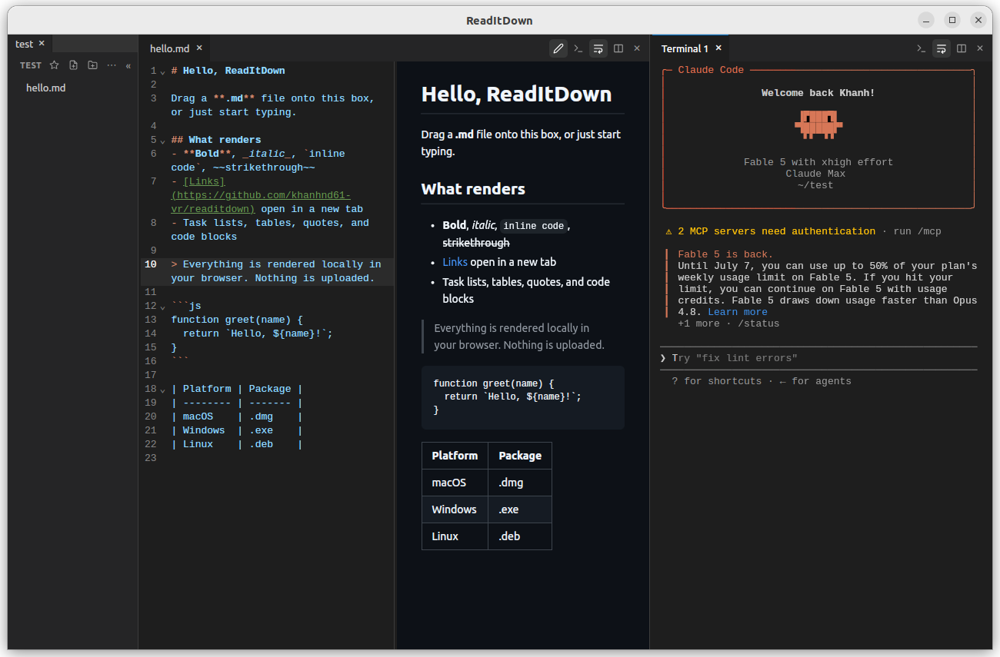

# ReadItDown - Minimal markdown viewer

Download [here](https://havi.fit/readitdown/).
Lazy web-based viewer is also available.



## Features

- Folder tree sidebar, open any directory
- Multiple tabs per pane, split panes side by side, drag divider to resize
- Edit while viewing: CodeMirror on the left, live preview on the right, Ctrl+S to save
- Create new files (nested paths like `notes/new.md` work)
- Two view modes per pane: wrap lines, or cut off with a horizontal scrollbar
- Renders embedded HTML and images (png, jpg, gif, ...)
- Links: external URLs open in the browser, relative `.md` links open in a tab,
  `/absolute` links resolve from the opened folder, `#anchors` scroll

## Prerequisites

Every platform needs Rust and Node.js. On Linux and macOS install Rust with:

```sh
curl --proto '=https' --tlsv1.2 -sSf https://sh.rustup.rs | sh
```

Node.js: any recent LTS (from [nodejs.org](https://nodejs.org), nvm, or brew).

### Linux (Ubuntu/Debian)

```sh
sudo apt install libwebkit2gtk-4.1-dev build-essential curl wget file \
  libxdo-dev libssl-dev libayatana-appindicator3-dev librsvg2-dev libdbus-1-dev
```

### macOS

```sh
xcode-select --install
```

No other system packages; the webview (WKWebView) ships with macOS.

### Windows (x86-64)

1. **Rust** - install [rustup](https://rustup.rs) (`rustup-init.exe`); take the default
   MSVC toolchain.
2. **Microsoft C++ Build Tools** - the MSVC linker Rust needs. Install "Visual Studio
   Build Tools" (or Visual Studio) with the **Desktop development with C++** workload.
3. **WebView2 runtime** - the webview Tauri renders into. Preinstalled on current
   Windows 11 and up-to-date Windows 10; otherwise grab the Evergreen bootstrapper from
   [Microsoft](https://developer.microsoft.com/microsoft-edge/webview2/).
4. **Node.js** - any recent LTS from [nodejs.org](https://nodejs.org).

Run the build commands below from **PowerShell** or **Command Prompt** (not Git Bash),
so the MSVC toolchain is on `PATH`.

## Run

Same on all platforms:

```sh
npm install
npm run tauri dev
```

Open the `sample/` folder to try every feature.

## Build

Same command on all platforms, artifacts differ:

```sh
npm run tauri build
```

Artifacts land in `src-tauri/target/release/`:

- `readitdown` (`readitdown.exe` on Windows) - the plain binary
- `bundle/` - installable packages
  - Linux: deb, rpm, AppImage
  - macOS: `macos/ReadItDown.app`, `dmg/ReadItDown_*.dmg` (for the host arch; on Apple
    Silicon add `-- --target universal-apple-darwin` to build a universal binary)
  - Windows: `nsis/ReadItDown_0.2.0_x64-setup.exe` (NSIS installer) and
    `msi/ReadItDown_0.2.0_x64_en-US.msi` (MSI installer)
 
## CLI usage

```sh
readitdown        # open the app (welcome screen)
readitdown .      # open the current folder
readitdown ~/docs # open a specific folder
```

On Linux and macOS `readitdown` detaches from the terminal (release builds), so the
prompt returns immediately; set `READITDOWN_FOREGROUND=1` to keep it attached. On
Windows the GUI binary already returns the prompt right away (use `readitdown.exe`, or
`readitdown.exe .` to open the current folder).

## Install

### Linux

Pick one:

```sh
# deb (Ubuntu/Debian): installs /usr/bin/readitdown + desktop entry,
# remove with `sudo apt remove read-it-down`
sudo apt install ./src-tauri/target/release/bundle/deb/ReadItDown_0.2.0_amd64.deb

# no sudo: copy the binary onto your PATH
install -Dm755 src-tauri/target/release/readitdown ~/.local/bin/readitdown

# AppImage: portable single file, bundles its own libs
chmod +x src-tauri/target/release/bundle/appimage/ReadItDown_0.2.0_amd64.AppImage
```

rpm-based distros: use `bundle/rpm/ReadItDown-0.2.0-1.x86_64.rpm`.

### macOS

Build on a Mac (see the DMG note under [Build](#macos-dmg-step-needs-automation-permission)),
then either:

- copy `src-tauri/target/release/bundle/macos/ReadItDown.app` to `/Applications` yourself:

  ```sh
  cp -R src-tauri/target/release/bundle/macos/ReadItDown.app /Applications/
  ```

- or, if you produced a `.dmg`, open
  `src-tauri/target/release/bundle/dmg/ReadItDown_0.2.0_*.dmg` and drag ReadItDown to
  Applications

The app is unsigned, so the first launch needs right-click -> Open (or allow it under
System Settings -> Privacy & Security).

### Windows

Run either installer from `src-tauri\target\release\bundle\`:

- `nsis\ReadItDown_0.2.0_x64-setup.exe` - the NSIS setup wizard (recommended), or
- `msi\ReadItDown_0.2.0_x64_en-US.msi` - the MSI package

Both add a Start Menu entry and put `readitdown.exe` on `PATH`. You can also just run the
standalone `src-tauri\target\release\readitdown.exe` without installing.

The installer is unsigned, so SmartScreen may warn on first run: click **More info ->
Run anyway**.


## Release

Linux: `src-tauri/target/release/bundle/deb/*.deb`
macOS: `src-tauri/target/release/bundle/dmg/*.dmg`
Windows: `src-tauri/target/release/bundle/nsis/*.exe`